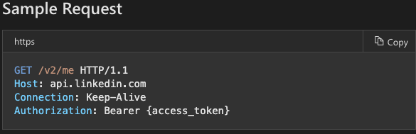

## OAuth Comparative Analysis
***
### LinkedIn
*** 
#### Research Conducted By:
* Brandon Gibbs
* Cas Ibrahim
* Reagan Roberts
* Blake Romero
* Joseph Zabaleta

##### Process Overview
1. Requires that you create an application
2. Requires that your application is linked to an organization or company with a LinkedIn profile
3. The request object will require:
    * response_type
    * client_id
    * redirect_uri
    * scope
    * state
4. Sending an https GET request to the redirect_uri will grant an authorization code
5. Next, the authorization code is exchanged for an access token using a POST request to `https://www.linkedin.com/oauth/v2/accessToken` requiring the following parameters:
    * code: authorization code from previous step
    * client_id
    * client_secret
    * redirect_uri
    * grant_type: 'authorization code'
6. This will return a JSON object containing two fields: 
    * access_token : the access token for the app, kept secure in .env
    * expires_in : the number of seconds remaining until the token expires
7. Authenticated API requests can now be made on behalf of the member by including an Authorization header in the HTTP call to LinkedIn's API

##### Pros
  * Detailed step-by-step documentation
  * Clear documentation with examples

##### Cons
  * Two sets of Documentation to sort through & decide between (LinkedIn -> Microsoft)
  * Lengthy Process
    * Room for error & missed steps
  * Need to Link to LinkedIn Organization/Company

##### Links & Resources
  * [App Configuration](https://developer.linkedin.com/docs/v2/oauth2-client-credentials-flow)
  * [Authentication](https://docs.microsoft.com/en-us/linkedin/shared/authentication/authentication?context=linkedin/consumer/context)